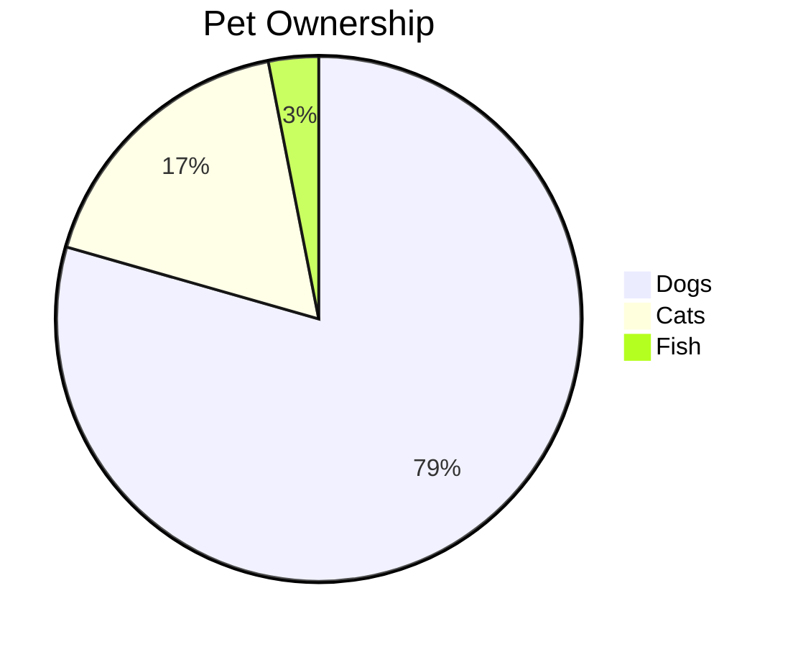

# Mermaid Diagrams in Hugo

This article demonstrates how to use Mermaid diagrams in your Hugo website.

## Flowchart Example


graph TD
    A[Start] --> B{Is it working?}
    B -->|Yes| C[Great!]
    B -->|No| D[Debug]
    D --> E[Fix issues]
    E --> B
    C --> F[End]


## Sequence Diagram Example


sequenceDiagram
    participant A as User
    participant B as Browser
    participant C as Server
    participant D as Database

    A->>B: Enter URL
    B->>C: HTTP Request
    C->>D: Query Data
    D-->>C: Return Data
    C-->>B: HTTP Response
    B-->>A: Display Page


## Gantt Chart Example


gantt
    title Project Timeline
    dateFormat  YYYY-MM-DD
    section Planning
    Planning Phase    :a1, 2025-01-01, 30d
    section Development
    Frontend          :a2, after a1, 45d
    Backend           :a3, after a1, 60d
    section Testing
    Testing Phase     :a4, after a2, 20d


## Class Diagram Example


classDiagram
    class Animal {
        +String name
        +int age
        +makeSound()
    }
    class Dog {
        +String breed
        +bark()
    }
    class Cat {
        +boolean indoor
        +meow()
    }
    Animal <|-- Dog
    Animal <|-- Cat


## Usage

To create a Mermaid diagram, use the shortcode:

```markdown

graph TD
    A --> B

```

You can also use fenced code blocks with the `mermaid` language identifier:


